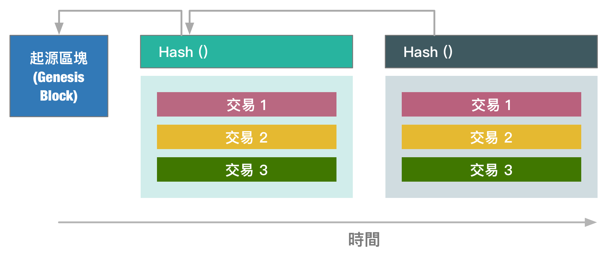

# Blockchain
區塊鏈技術目前受到了許多關注，不僅僅是指儲存交易分類賬本，也指數位貨幣，如比特幣(Bitcoin)，但將程式碼與資料封裝成智能合約(Smart Contracts)。本專案將針對現有的開放式原始碼區塊鏈技術進行整理與實作，以證明這些技術的可行性與優勢。

區塊鏈(Blockchain)是一個資料結構，它儲存著不斷增長的時間序列資料，如一個賬戶賬簿(Accounting ledger)。區塊鏈資料結構的維護是使用一種分散式(distributed)、對等式網路(peer-to-peer)與去中心主節點的架構。在一個鏈(chain)中的每個區塊(block)會包含表示資料庫中狀態變化的交易(_transactions_); 例如，資金從一個賬戶移轉到另一個賬戶。交易(transactions)是由網路中多個節點進行驗證，並最終被儲存於區塊鏈的區塊(_block_)中
每個區塊都包含一個簽證雜湊(signed hash)的內容，因此區塊不可能會被隨意的竄改內容
。它能夠橫跨整個區塊鏈，以確保一個區塊的雜湊值儲存在它後面的區塊中。

區塊鏈的一些關鍵特性，使它能夠吸引應用程式開發者：
* 區塊鏈可以由任何人執行。如果你的應用程式儲存在一個大眾的區塊鏈上的話，該應用程式將不需要提供自己的儲存機制來儲存資料。區塊鏈節點促進儲存與交易手續費，以及偶爾挖掘一些新貨幣。
* 區塊鏈提供一個分散式一致性的解決方案，該特性是很難實現的。
* 區塊鏈提供針對使用者的匿名。一個賬戶 ID 是一個公有金鑰(Public Key)，這不一定直接歸屬於一個人。
* "Value" 能夠從一個賬戶轉移到另一個賬戶，能以較小的費用、傳統電匯機制或是實際貨幣。
* 如果區塊鏈是可信任的，即儲存在其中的交易資料是能夠被信任的，但這過程要經過許多節點進行驗證。

以下整理陳列一些相關區塊鏈技術專案與平台：
* [Ethereum](https://www.ethereum.org/)
* [Openchain](https://www.openchain.org/)
* [Hyperledger](https://www.hyperledger.org/)
* [Multichain](http://www.multichain.com/)
* [GCOIN](http://g-coin.org/learn.html)
* [Bitcore](https://github.com/bitpay/bitcore)
* [dnschain](https://github.com/okTurtles/dnschain)
* [blockstack](http://blockstack.org)
* [IBM Blockchain](http://www.ibm.com/blockchain/)
* [Ripple](https://ripple.com/)
* [Steller](https://www.stellar.org/about/mandate/)
* [Eris](https://erisindustries.com/)
* [Tendermint](http://tendermint.com/)
* [Chain of Things](http://www.chainofthings.com/)
