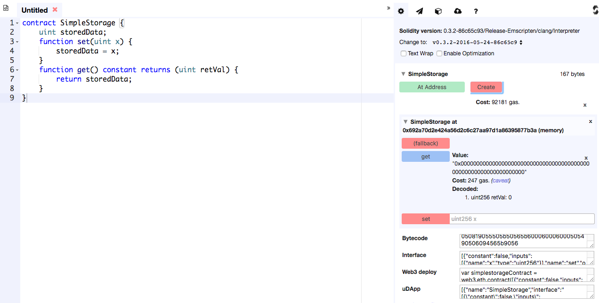
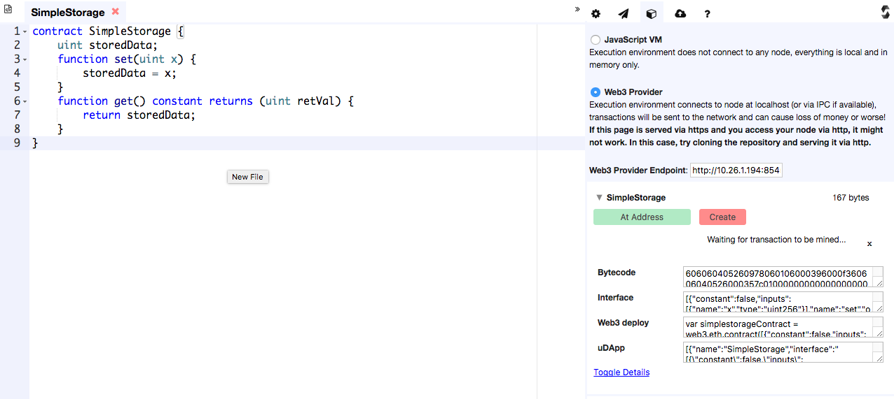

# Ubuntu Multi Geth Instances
本節將說明如何透過 Ubuntu 部署 Go Ethereum。並利用簡單的指令來進行 Demo。

### 事前準備
本次會使用到兩個節點來建立 Geth Instances，其規格如下：

|    Role   |   CPUs   |   RAM    |   Disk   |
|-----------|----------|----------|----------|
|  geth-1   |  2vCPU   |   4 GB   |  40 GB   |
|  geth-2   |  2vCPU   |   4 GB   |  40 GB   |

首先在每個節點安裝 Ethereum 最新版本，可以依照官方透過以下方式快速安裝：
```sh
$ sudo apt-get install -y software-properties-common
$ sudo add-apt-repository -y ppa:ethereum/ethereum
$ sudo apt-get update && sudo apt-get install ethereum
```

在每個節點建立一個`private.json`檔案來定義創世區塊(Genesis Block)，內容如下：
```
{
	"coinbase" : "0x0000000000000000000000000000000000000000",
  "difficulty" : "0x40000",
  "extraData" : "Custem Ethereum Genesis Block",
  "gasLimit" : "0xffffffff",
  "nonce" : "0x0000000000000042",
  "mixhash" : "0x0000000000000000000000000000000000000000000000000000000000000000",
  "parentHash" : "0x0000000000000000000000000000000000000000000000000000000000000000",
  "timestamp" : "0x00",
  "config": {
		"chainId": 123,
		"homesteadBlock": 0,
		"eip155Block": 0,
		"eip158Block": 0
	},
	"alloc": { }
}
```

初始化創世區塊：
```sh
$ geth init --datadir=data/ private.json
```

在每個節點新增一名稱為`eth-private.sh`的腳本程式，將用於啟動 geth，並放置背景：
```sh
#!/bin/bash
# Program:
#       This program is a private geth runner.
# History:
# 2016/05/22 Kyle Bai Release
#
echo "Starting private geth"
screen -dmS geth /usr/bin/geth \
            --datadir data/ \
            --networkid 123 \
            --nodiscover \
            --maxpeers 5 \
            --port 30301 \
            --rpc \
            --rpcaddr "0.0.0.0" \
            --rpcport "8545" \
            --rpcapi "admin,db,eth,debug,miner,net,shh,txpool,personal,web3" \
            --rpccorsdomain "*" \
            -verbosity 6
```
> 更多的參數，請參考 [Command-Line-Options](https://github.com/ethereum/go-ethereum/wiki/Command-Line-Options)。

建立完成後，修改執行權限：
```sh
$ chmod u+x geth-private.sh
```

### 建置 Ethereum 環境
首先進入到`geth-1`節點透過以下方式來啟動：
```sh
$ ./geth-private.sh
Starting private geth
```
> 這時候會透過 screen 執行於背景，我們可以透過```screen -x geth```來進行前景。若要回到背景則透過```[Ctrl-A] + [Ctrl-D]```來 detached。要關閉 screen 則透過 ```[Ctrl-C]```。

接著為了確認是否正確啟動，我們可以透過 geth 的 attach 指令來連接 console：
```sh
$ geth attach ipc:data/geth.ipc
```
> 也可以透過 HTTP 方式 attach，```geth attach http://localhost:8545```。

> 若一開始建立沒有 RPC，但想要加入 RPC 可以 attach 後，輸入以下 function：
```sh
> admin.startRPC("0.0.0.0", 8545, "*", "web3,db,net,eth")
```

進入後透過 admin API 來取得節點的資訊：
```sh
> admin.nodeInfo.enode
"enode://e3dd0392a2971c4b0c4c43a01cd682e19f31aaa573c43a9b227685af7ffed5070217392ae5ada278968d5c4bfddd9c93547bcf4592852196a8facbcdad64d257@[::]:30301?discport=0"
```
> 這邊要取代```[::]```為主機 IP，如以下：
```
"enode://e3dd0392a2971c4b0c4c43a01cd682e19f31aaa573c43a9b227685af7ffed5070217392ae5ada278968d5c4bfddd9c93547bcf4592852196a8facbcdad64d257@172.16.1.99:30301?discport=0"
```

上面沒問題後，接著進入到`geth-2`節點，然後透過以下指令開啟 console：
```sh
$ geth init --datadir=data/ private.json
$ geth --datadir data/ \
       --networkid 123 \
       --nodiscover \
       --maxpeers 5 \
       --port 30301 \
       --rpc \
       --rpcaddr "0.0.0.0" \
       --rpcport "8545" \
       --rpcapi "admin,db,eth,debug,miner,net,shh,txpool,personal,web3" \
      --rpccorsdomain "*" \
      -verbosity 6 \
       console
```
> 也可以透過上一個節點的方式將服務放到背景，在 attach。

完成上面指令會直接進入 console，接著透過以下方式來連接`geth-1`：
```sh
> admin.addPeer("enode://e3dd0392a2971c4b0c4c43a01cd682e19f31aaa573c43a9b227685af7ffed5070217392ae5ada278968d5c4bfddd9c93547bcf4592852196a8facbcdad64d257@172.16.1.99:30301?discport=0")
true

I0525 12:56:40.623642 eth/downloader/downloader.go:239] Registering peer e3dd0392a2971c4b
I0525 12:57:10.622920 p2p/server.go:467] <-taskdone: wait for dial hist expire (29.99999387s)
```

接著透過 net API 進行查看連接狀態：
```sh
> net.peerCount
1

> admin.peers
[{
    caps: ["eth/61", "eth/62", "eth/63"],
    id: "e3dd0392a2971c4b0c4c43a01cd682e19f31aaa573c43a9b227685af7ffed5070217392ae5ada278968d5c4bfddd9c93547bcf4592852196a8facbcdad64d257",
    name: "Geth/v1.4.5-stable/linux/go1.5.1",
    network: {
      localAddress: "172.16.1.100:51038",
      remoteAddress: "172.16.1.99:30301"
    },
    protocols: {
      eth: {
        difficulty: 131072,
        head: "882048e0d045ea48903eddb4c50825a4e3c6c1a055df6a32244e9a9239f8c5e8",
        version: 63
      }
    }
}]
```

### 驗證服務
這部分將透過幾個指令與流程來驗證服務，首先在`geth-1`透過 attach 進入，並建立一個賬戶與查看乙太幣：
```sh
$ geth attach http://localhost:8545

> kairen = personal.newAccount();
Passphrase:
Repeat passphrase:
"0xcb41ad8ba28c4b8b52eee159ef3bb6da197ff60b"

> personal.listAccounts
["0xcb41ad8ba28c4b8b52eee159ef3bb6da197ff60b"]

> web3.fromWei(eth.getBalance(kairen), "ether");
0
```
> P.S. 若要移除帳號，可以刪除```data/keystore```底下的檔案。

接著在```geth-2```透過以下指令建立一個賬戶與查看乙太幣：
```sh
> pingyu = personal.newAccount();
Passphrase:
Repeat passphrase:
"0xf8c70df559cb9225f6e426d0f139fd6e8752c644"

> personal.listAccounts
["0xf8c70df559cb9225f6e426d0f139fd6e8752c644"]

> web3.fromWei(eth.getBalance(pingyu), "ether");
0
```

接著回到`geth-1`來賺取一些要交易的乙太幣：
```sh
> miner.setEtherbase(kairen)
true
```

當賬戶設定完成後，就可以執行以下指令進行採礦：
```sh
> miner.start(1)
true
```
> 這邊需要一點時間產生 DAG，可以開一個新的命令列透過```screen -x geth```查看。

> 經過一段時間後，當 DAG 完成並開始採擴時就可以```miner.stop()```。

接著在```geth-1```查看賬戶的乙太幣：
```sh
> web3.fromWei(eth.getBalance(kairen), "ether");
40.78125
```

當成開採區塊後，就可以查看```geth-1```共採集的 ether balance 的數值：
```
> eth.getBalance(eth.coinbase).toNumber()
40781250000000000000
```
> 即為```40.78125```乙太幣。

接著我們要在將```geth-1```的賬戶乙太幣轉移到```geth-2```上，首先在```geth-1```上建立一個變數來存```geth-2```的賬戶位址：
```sh
> consumer = "0xf8c70df559cb9225f6e426d0f139fd6e8752c644"
"0xf8c70df559cb9225f6e426d0f139fd6e8752c644"
```

完成上述後，首先要將賬戶解鎖：
```sh
> personal.unlockAccount(kairen)
true
```
> 輸入當初建立賬戶的密碼。

並透過 eth API 的交易函式還將 ether balance 數值轉移：
```sh
$ eth.sendTransaction({from: kairen, to: consumer, value: web3.toWei(10, "ether")})
"0x1aee9082a55751c59077a273e7b08acd028d5099a4986f002518b0c8919d9e36"
```

若有在每一台 geth 節點上進入 debug 模式的話，會發現該交易資訊被存到一個區塊，這邊也可以透過 txpool 與 eth API 來查看：
```sh
> txpool.status
{
  pending: 1,
  queued: 0
}

> eth.getBlock("pending", true).transactions
[{
    blockHash: "0x0b58d0b17e02f56746b0b5b22f195b6ae71d47343bf778763c4c476386ad7db7",
    blockNumber: 112,
    from: "0xcb41ad8ba28c4b8b52eee159ef3bb6da197ff60b",
    gas: 90000,
    gasPrice: 20000000000,
    hash: "0x1aee9082a55751c59077a273e7b08acd028d5099a4986f002518b0c8919d9e36",
    input: "0x",
    nonce: 0,
    to: "0xf8c70df559cb9225f6e426d0f139fd6e8752c644",
    transactionIndex: 0,
    value: 10000000000000000000
}]
```
> 這邊的```pending```表示目前還沒有被驗證，因此我們需要一些節點來進行採礦驗證。這邊也可以發現該交易資訊被存在區塊編號```112```，可以提供往後查詢之用。

接著回到```geth-2```節點，查看目前的數值變化：
```sh
> web3.fromWei(eth.getBalance(pingyu), "ether");
0
```

這邊會發現沒有任何錢進來，Why? so sad。其實是因為該區塊還沒有被採集與認證，因此該交易不會被執行。

因此我們需要在任一節點提供運算，這邊在```geth-1```執行以下指令來進行採礦，這樣就可以看到該交易被驗證與接受：
```sh
> miner.start(1)
true

TX(1aee9082a55751c59077a273e7b08acd028d5099a4986f002518b0c8919d9e36)
Contract: false
From:     cb41ad8ba28c4b8b52eee159ef3bb6da197ff60b
To:       f8c70df559cb9225f6e426d0f139fd6e8752c644
Nonce:    0
GasPrice: 20000000000
GasLimit  90000
Value:    10000000000000000000
Data:     0x
V:        0x1c
R:        0x9de7d843959f55a553577dc68a887893adf1b80eccd872021dfa6b8bcf3db43
S:        0x287f8e01640ccd5924308725d2d274def7edc4a18169b36ae26c95216fdf0fed
Hex:      f86d808504a817c80083015f9094f8c70df559cb9225f6e426d0f139fd6e8752c644888ac7230489e80000801ca009de7d843959f55a553577dc68a887893adf1b80eccd872021dfa6b8bcf3db43a0287f8e01640ccd5924308725d2d274def7edc4a18169b36ae26c95216fdf0fed
```
> 當該區塊的交易確認沒問題被執行後，就可以透過```miner.stop()```停止採礦。


這時再回到```geth-2```節點，查看目前的數值變化，會發現增加了 10 枚乙太幣：
```sh
> web3.fromWei(eth.getBalance(pingyu), "ether");
10
```

之後可以在任一節點透過 eth web3 的 API 來查找指定區塊的交易資訊：
```sh
> eth.getTransactionFromBlock(40)
{
  blockHash: "0xe839c1392657731417fc04b9aecf7a181dd339086d5f7cdea0bccc2b1483b885",
  blockNumber: 112,
  from: "0xcb41ad8ba28c4b8b52eee159ef3bb6da197ff60b",
  gas: 90000,
  gasPrice: 20000000000,
  hash: "0x1aee9082a55751c59077a273e7b08acd028d5099a4986f002518b0c8919d9e36",
  input: "0x",
  nonce: 0,
  to: "0xf8c70df559cb9225f6e426d0f139fd6e8752c644",
  transactionIndex: 0,
  value: 10000000000000000000
}
```

### 簡單的 Contract
這邊將說明如何建立一個簡單的合約(Contract)來部署於區塊鏈上，首先複製以下內容：
```
contract SimpleStorage {
    uint storedData;
    function set(uint x) {
        storedData = x;
    }
    function get() constant returns (uint retVal) {
        return storedData;
    }
}
```

接著將內容貼到 [browser-solidity](https://ethereum.github.io/browser-solidity) 進行編譯成 JavaScript。如快照畫面所示。



透過這個 IDE 可以將 Solidity 語言轉換成 web3 code(JavaScript)，複製 web3 code 的內容，並儲存成```SimpleStorage.js```檔案放置到```geth-1```上。接著 attach 進入 geth 執行以下指令：
```sh
> loadScript('SimpleStorage.js');
```

若有自行安裝```browser-solidity```的話，則可以使用如下圖一樣的方式連接。


