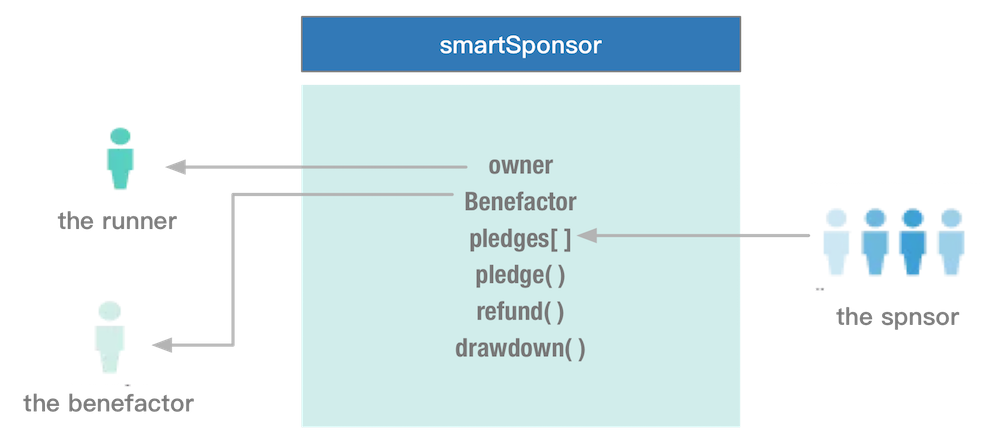
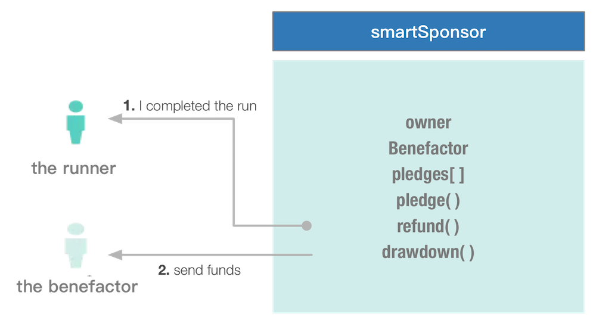
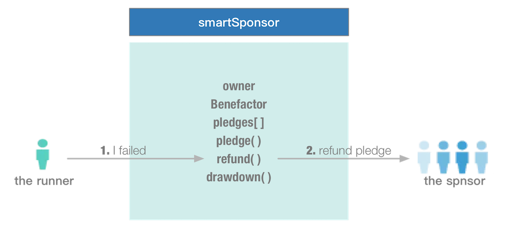

# 智能合約(Smart contracts)
智能合約(Smart Contracts) 是在 Ethereum 區塊鏈中所屬的物件。它們包含程式碼函式以及能夠與其他合約進行互動、做出決策、儲存資料與傳送乙太幣給其他人。合約是由創建者所定義，但是它們的執行與他們所提供的服務，都是由 Ethereum 網路本身提供。它們將存在且可被執行，只要整個網路存在，並且只會因程式中有撰寫自我銷毀的功能才會消失。

我可以用合約做什麼呢？只要想像力夠豐富，要做什麼幾乎都沒問題，但以下指南只會是入門，讓我們去實現一些簡單的事情。

- [Hello World](#hello-world)
- [Smart Sponsor](#smartsponsor)

### Hello World
本節將透過建立一個典型的 "Hello World" 的合約，然後你可以建立自己的加密 token 去存送給任何你喜歡的人。一旦你掌握了，那你將透過群資募款來集資，如果成功了，將提供一個完全透明、民主的組織，將只服從它自己的公民，將永遠不會遠離它的憲法，以及受到審查與關閉。

(TBD)

### Smart Sponsor
本節將說明一智能合約範例，透過建構一個合約來允許以下賬戶持有人進行互動。
* 一個慈善機構舉行籌款活動，我們稱之為 **thebenefactor**。
* 一個受贊助的 runner 想為慈善機構募款，我們稱之為 **therunner**。
* 其他的人想要贊助 runner，我們稱之為 **thesponsor**。
* 一個 Ethereum 節點，用來開採區塊鏈以驗證交易，我們稱之為 **theminer**。

我們的合約(smartSponsor)：
* 是由一位 **runner** 透過贊助的執行來為慈善機構募款。
* 當建立合約時，**runner** 會任命為募集錢的捐助者。
* **runner** 則邀情其他人去進行贊助。用戶透過呼叫一個在智能合約上的函式，將乙太幣從 **贊助商的帳戶** 轉移到 **合約**，並保持乙太幣於合約，直到有進一步的通知。
* 在合約的時限期間的所有人都能看到誰是 **捐助者**，有多少的乙太幣被從誰捐(雖然贊助者可以匿名，當然:p)。



那麼有兩件事情可能發生：
* 執行都按計劃進行，以及 **runner** 指示合約轉移到所有資金的捐助者。



* 執行由於謀些原因無法承擔，而 runner 指示合約將退還贊助商的抵押。



Ethereum 允許智能合約由撰寫 Solidity 語言來定義。Solidity 的合約是類似於 Java 的類別定義。成員變數的儲存採用區塊鍊交易與合約的方法，來詢問合約或改變的其狀態。作為區塊鏈的副本會分散到網路中的所有節點，任何人都可以詢問合約，以從中搜尋公開的訊息。

合約有以下幾種方法：
* **```smartSponsor```**：合約的建構子。它初始化合約的狀態。合約的建立者傳入賬戶的位址，有利於合約的 drawdown。
* **```pledge```**：任何人都可以呼叫捐贈乙太幣贊助基金。贊助商提供支援的選擇性訊息
* **```getPot```**：回傳當前儲存在合約的總乙太幣。
* **```refund```**：把贊助商的錢退回給贊助商。只有合約的擁有者才能呼叫這個函式。
* **```drawdown```**：傳送合約的總價值給捐助者賬戶。只有合約的擁有者才能呼叫這個函式。

這個想法是使一個合約擁有約束力。他們不能拿回任何資金，除非整個合約被退還。在這種情況下，所有資料都是被公開存取的，這意味著任何人都有存取 Ethereum 區塊鏈，來查看誰建立了合約，誰是捐助者，以及誰透過存取合約程式碼本身保證了每一筆資金。

要注意很重要的一點，任何改變合約的狀態(建立、承若、退還或 drawing down)都需要在區塊鏈上建立交易，這意味著這些交易不會被儲存，要直到這些交易的區塊被開採。操作只能讀取到一個現有合約狀態(getPot 或讀取公有成員變數)都不需要進行挖礦。這是一個很重要且微妙的點：寫入操作是很慢的(因為我們要等到採礦完成)。由於這情況合約可能永遠不會被建立到區塊鍊中，因此呼叫方需要提供一些獎勵，來促進礦工去工作。這是被稱為 gas 的 Ethereum 術語，所有的寫入操作都是需要 gas 的支出來改變區塊鍊的狀態。

幸運的是我們不需要購買真正的乙太幣，以及參與 Ethereum 網路。我們可以使用相同的軟體，但要配置它運行一個本地測試區塊鏈，以及產生自己的假乙太幣。

以下為一個 Solidity 語言的智能合約範例：
```java
contract smartSponsor {
  address public owner;
  address public benefactor;
  bool public refunded;
  bool public complete;
  uint public numPledges;
  struct Pledge {
    uint amount;
    address eth_address;
    bytes32 message;
  }
  mapping(uint => Pledge) public pledges;

  // constructor
  function smartSponsor(address _benefactor) {
    owner = msg.sender;
    numPledges = 0;
    refunded = false;
    complete = false;
    benefactor = _benefactor;
  }

  // add a new pledge
  function pledge(bytes32 _message) payable {
    if (msg.value == 0 || complete || refunded) throw;
    pledges[numPledges] = Pledge(msg.value, msg.sender, _message);
    numPledges++;
  }

  function getPot() constant returns (uint) {
    return this.balance;
  }

  // refund the backers
  function refund() {
    if (msg.sender != owner || complete || refunded) throw;
    for (uint i = 0; i < numPledges; ++i) {
      pledges[i].eth_address.send(pledges[i].amount);
    }
    refunded = true;
    complete = true;
  }

  // send funds to the contract benefactor
  function drawdown() {
    if (msg.sender != owner || complete || refunded) throw;
    benefactor.send(this.balance);
    complete = true;
  }
}
```
> * 一個```Pledge```結構模型的捐贈，儲存著贊助商的帳戶 ID、承若押金，以及一些訊息字串。

> * 這個 ```pledges``` 陣列儲存了一個承若方的列表。

> * 合約中的所有成員變數都是公開的，所以```getters```將自動被建立。

> * ```throw```被稱為某些函式(functions)，用以防止資料被寫入錯誤的資料到該區塊鏈中。

# 參考連結
* [Our thoughts on Ethereum](https://medium.com/@kpcb_edge/our-thoughts-on-ethereum-31520b164e00#.2q1i88278)
* [Building a smart contract using the command line](https://www.ethereum.org/greeter)
* [Block chain technology, smart contracts and Ethereum](https://developer.ibm.com/clouddataservices/2016/05/19/block-chain-technology-smart-contracts-and-ethereum/)
