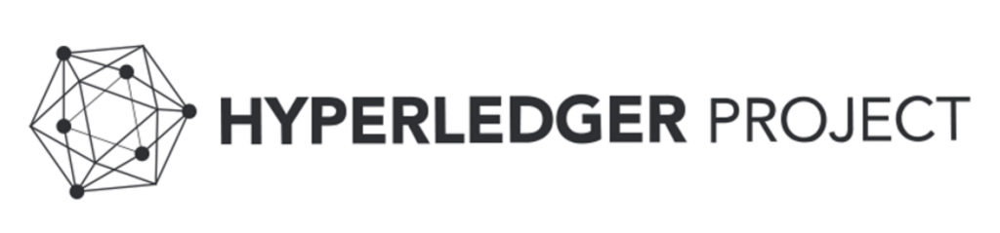

# Hyperledger
Hyperledger 專案是 IBM 與 Linux 基金會於 2015 年底共同推動的區塊鏈基礎專案，該專案吸引來自多行業巨頭的參與，並且該專案也很有可能成為未來企業級的區塊鏈技術底層架構基礎，因此該專案被受到高度關注。

以 Hyperledger 作為企業對企業(B2B)、企業對消費者(B2C)的一種交易協定，既符合規章制度，又能夠支援各種類型需求的實現。其設計的核心元素是```智能合約(Smart Contracts)```、數位資產、記錄儲存庫、一致性對等網路、安全的加密與分散式總賬本等。此外，區塊鍊主要還涉及行業效能要求、身份認證與私下機密交易等。Hyperledger 基於以上建立一個對等網路的分散式總帳技術交易應用程式，透過建立信任、問責制與透明度，並同時簡化業務流程，把它看成是一個作業系統來互動，因此大大的化簡了成本與複雜性。



## 其他參考連結
- [hyperledger-py](https://github.com/yeasy/hyperledger-py)
- [hyperledger chaincode_example02](https://github.com/hyperledger/fabric/blob/master/examples/chaincode/go/chaincode_example02/chaincode_example02.go)
- [8btc](http://www.8btc.com/hyperledger)
- [Technical Introduction to Hyperledger Fabric](http://www.altoros.com/blog/technical-introduction-to-hyperledger-fabric/)
